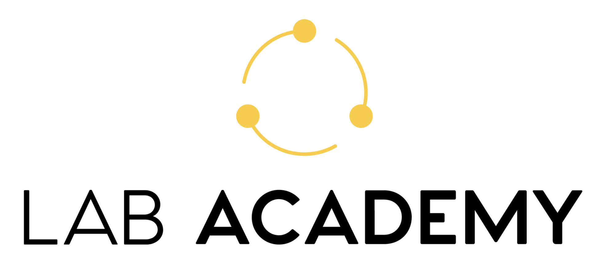
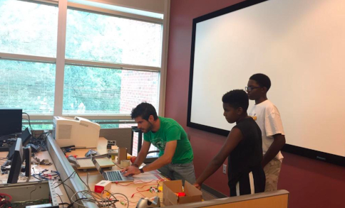
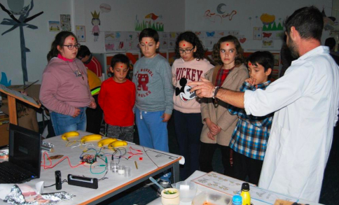
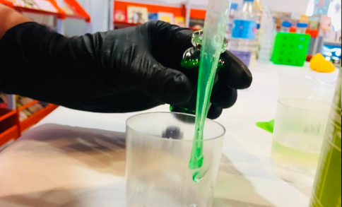

> Lab Academy is the educational brand of SciArt Lab. Here you will find information about our academic projects, workshops, master classes and educational activities.

## STEAM Education & Commons Production

We believe in decentralized collaboration and collective production of knowledge. In addition to partnerships with universities and companies, we have an open network of collaborators oriented to contribute to the production of commons. 

We foster multidisciplinary knowledge and technology-driven creativity, following peer-to-peer learning dynamics and unconventional research approaches to hack seemingly unrelated topics such as virtual reality, cognitive neuroscience, music, education, chemistry or digital art.

Promoting Science, Art and Technology as emancipatory tools, we help future hackers and critical thinkers to understand the world with DIY experiments, virtual reality and hands-on learning.

* Research collaboration with universities.
* STEAM Education in Schools and Libraries.
* Open Source Projects.

## Udemy Certified Masterclass

We also offer online courses about our areas of expertise. **Lab Academy** has presence in the [Decentraland metaverse](http://academy.sciartlab.com) and in [Udemy](http://p2p.essentials.sciartlab.com).

You can enroll in our last masterclass, **P2P Essentials: Beyond Blockchain Technologies and NFTs** [here](http://p2p.essentials.sciartlab.com).

### P2P Essentials: Beyond Blockchain Technologies and NFTs

> Learn about Web3, NFTs and the Metaverse and get your certificate.

In this course, you will get a full understanding of decentralization and the Peer-to-Peer (P2P) web.

We will start explaining how blockchain technology works, and how Bitcoin and cryptocurrencies gave arise to decentralized finance.

We will delve into Non Fungible Tokens, and we will focus on specific actual examples to show you how the blockchain has been used to monetize art and even create a digital replicate of the Real Estate industry.

We will discuss the advantages and disadvantages of specific distributed technologies and dig into different protocols beyond blockchains, such as Holochain, IPFS or Hypercore. You will learn to browse the decentralized web and publish your own content using these procotols and specific browsers. You will experience the Metaverse and its fascinating game-changing potential, learning about NFTs (non-fungible tokens).

At the end of the course, you will be able to talk confidently about what is Ethereum, what is a Smart Contract, what is Web3, and how a dApp works.  You even will be able to create your own P2P website by using the Hypercore Protocol without the need for any initial technical knowledge, and to experience a decentralized virtual world through an avatar in Decentraland.

We will navigate the implications of distributed ledgers and smart contracts for decision-making, exploring how blockchains and off-chain voting technologies can bring governance to digital communities. This will lead us to talk about Decentralized Autonomous Organizations (DAOs).

Before finishing the course, we will discuss the social implications of these technologies and their sustainability, distinguishing in which context they should be used.

You will end up with a basic understanding of P2P Essentials, required building blocks to be part of a decentralized future.

[Enroll now](http://p2p.essentials.sciartlab.com/)

