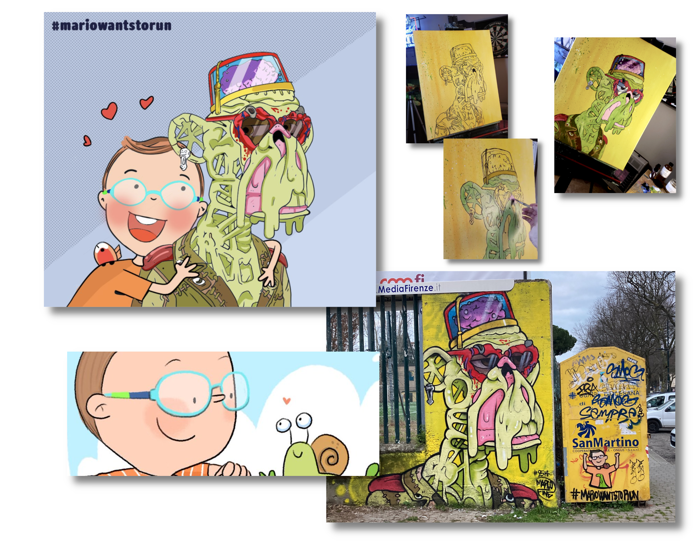
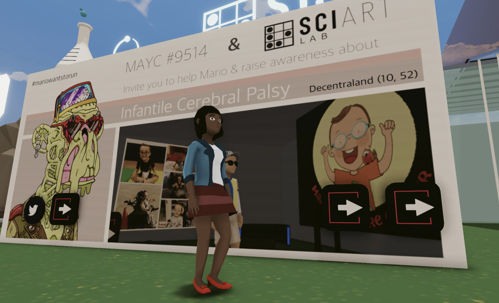
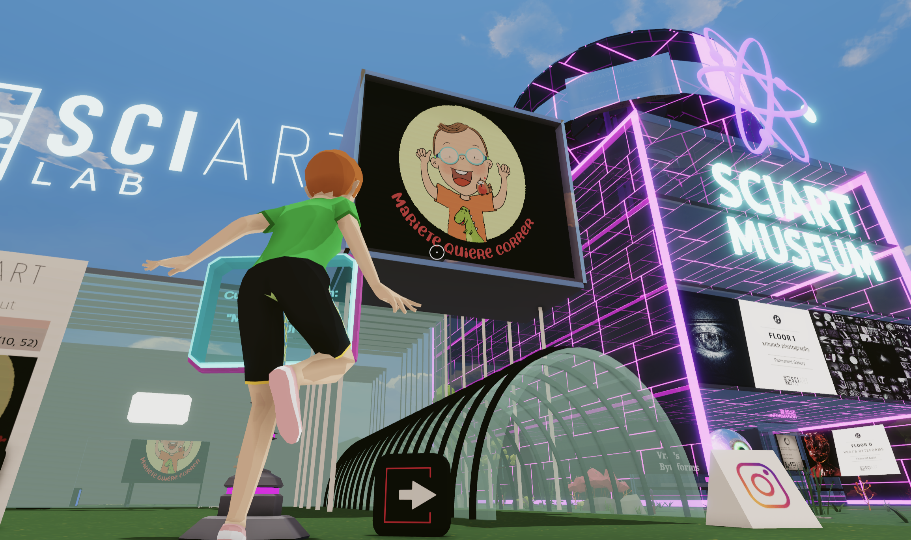
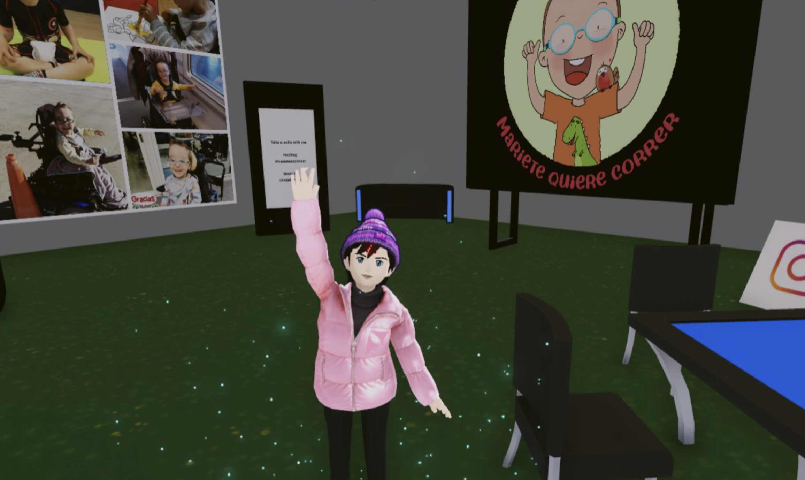
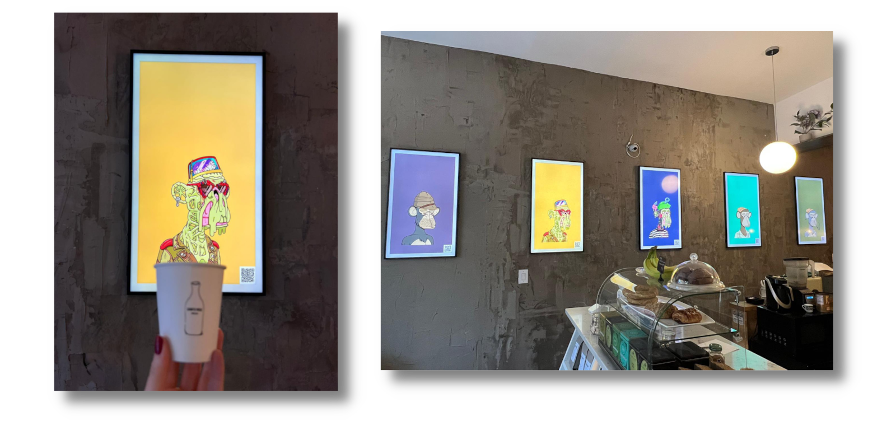
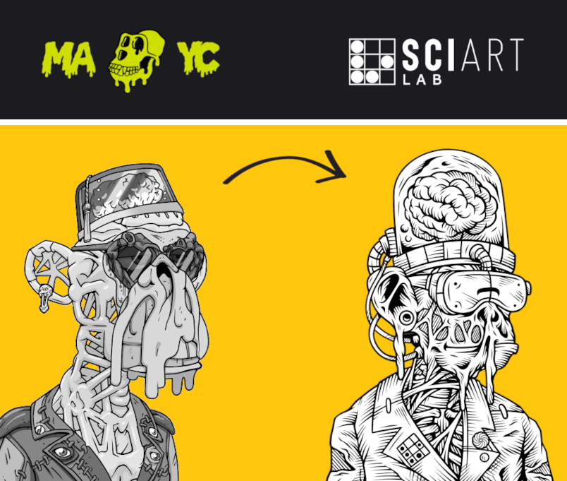

**Mutant #9514** is an NFT (Non-Fungible Token) acquired by [**SciArt Lab**](https://www.sciartlab.com/) in 2021, with implicit ownership over the artwork, intellectual property rights, and membership to [Bored Ape Yacht Club](https://boredapeyachtclub.com/). Since then, **Mutant #9514** has become an important part of our brand, turning into something like a mascot for our organization. 

As a non-human entity who lives in the blockchain, **Mutant #9514** can be a good official face to represent everything we do commercially, but also to personify altruistic actions without a specific human face behind. In that regard, **SciArt Lab** decided to use the power of this image for *pro bono* work. Especially to support artists, experimental projects, and social causes. 

**Mutant #9514** is an example of how one NFT can be used for a fascinating variety of purposes. For example, for raising awareness about social issues like **Infantile Cerebral Palsy**, raising funds for a non-profit organization or promoting new artists. To learn more about everything our mutant has accomplished, keep reading.

## Non-Profit Social Campaigns

Mutants and superheroes share some characteristics. Both can do amazing things. And that is the reason for **Mutant #9514** to be the image of the first campaign in the *Metaverse* to raise funds and awareness about **Infantile Cerebral Palsy** and help little superheroes like Mario, a five-year-old kid whose dream is to be able to run one day. 

**SciArt Lab** included [Marco Fine](https://www.instagram.com/p_ThaNerd/), an Italian mural artist, in our **New Talents** program. Marco Fine was authorized to use **Mutant #9514** in his street art. He painted an amazing mural of our mutant in Florence (Italy). Marco accepted to include the hashtag **#mariowantstorun** to support our campaign for **Infantile Cerebral Palsy**.

In addition to Marco, other artists joined our campaign worldwide. For example, [Barış Atar](@barisatar), a visual artist based in Istanbul, contributed to the campaign with an illustration of Mario hugging MAYC #9514, a derivative work based on [M. Ángeles Aznar Medina](https://mundoilustradoshop.com/)’s and Bored Ape Yacht Club's original artworks. Also [Moonie](https://twitter.com/Moonie69420), an American artist from Colorado, oil painted a mutant with the hashtag  **#mariowantstorun**. The artwork will be sold in an auction and the benefits will be donated to the cause.

**SciArt Lab** also developed a virtual space for the campaign in our Metaverse District in **Decentraland**. People all over the world showed their support. Read more about the campaign and how to contribute [here](mario.md).

   

In January 2022, **SciArt Lab** also authorized [Perris Mackey](https://www.instagram.com/p_ThaNerd/), an American collage artist, to use **Mutant #9514** in a piece of analog art. 25% of the benefits will be donated to [R.A.K.E (Random Acts of Kindness Everywhere)](http://www.rakenow.org/), a 501c3 non-profit organization based in Cleveland, Ohio. Additionally, Perris Mackey's artwork will include an easter egg with the hashtag **#mariowantstorun** to support the campaign.

## Exhibitions, cameos, and collaborations

* Our Mutant has been exhibited in **Lion's Milk**, [the first cafe/bar displaying NFTs (PFPs)](https://twitter.com/137pm/status/1489341125852860417) in Brooklin, New York. 

 

* Our mutant has been also selected to participate as an extra in one music video of [ESCAPΞPLAN](https://twitter.com/escapeplanbayc), the world's first-ever Bored Ape producer-DJ duo.

* **Mutant #9514** will also participate with a cameo in a TV show of **Bored Ape Studios**, the Metaverse-first creative agency prepping Bored and Mutant Apes for commercial animations.

* This mutant was also licensed to **The Writer's Room** on **Jan 1, 2022**. New York Times bestseller writer **Neil Strauss**, in collaboration with the community of license holders, is working on the first blockchain-based collaborative writing book of history. **[[More info](https://www.jenkinsthevalet.com/press)]**

## Brand development

Despite having IP rights over the artwork, we wanted to use our mutant as an inspiration to create our own visual story. With that purpose in mind, we hired [Andreas Damas](https://www.behance.net/andreasdamas), a graphic designer, and illustrator based in Yogyakarta, Indonesia, to develop a visual concept of what SciArt Lab represents.

This drawing includes some foundational concepts which visually summarize our direction. The *mutant ape* represents our human nature as primates who are able to evolve and dynamically transform into something different through a lifetime. 

The Virtual Reality glasses in combination with the brain represent our direction towards the intersections of neuroscience / mental health and the Metaverse. 

The little pins on the jacket are actually two key symbols of our journey. One is the rotated hacker emblem that characterizes our SciArt Lab's logo (which embodies creativity and playful open-ended learning). The other is the enigmatic logo of Sense Garden, which reminds us of the importance of wellness and inner balance. 

Both are visual reminders of our mutant-like potential and represent foundational guidelines towards our next evolutionary steps. 

This visual concept summarizes our biological impulse towards multidisciplinary research,  creative experimentation, and unconventional innovation.

It is our non-linguistic attempt to express our mission in a way that recognizes the importance of the NFT Community in our development as an independent brand pursuing its own dreams & goals.

## Join us

  

To join one of our current campaigns, you can reach us through our [Twitter](https://www.twitter.com/sciartlab) or send an email to **contact@sciartlab.com**.

If you want to support **#mariowantstorun** we are open to any kind of help or contribution. Creativity is welcome! 

We are open to talking to artists about how they can use **Mutant #9514** in their art derivatives. We are also willing to support social projects and authorize them to include our mutant in their campaigns.

Join the fam!