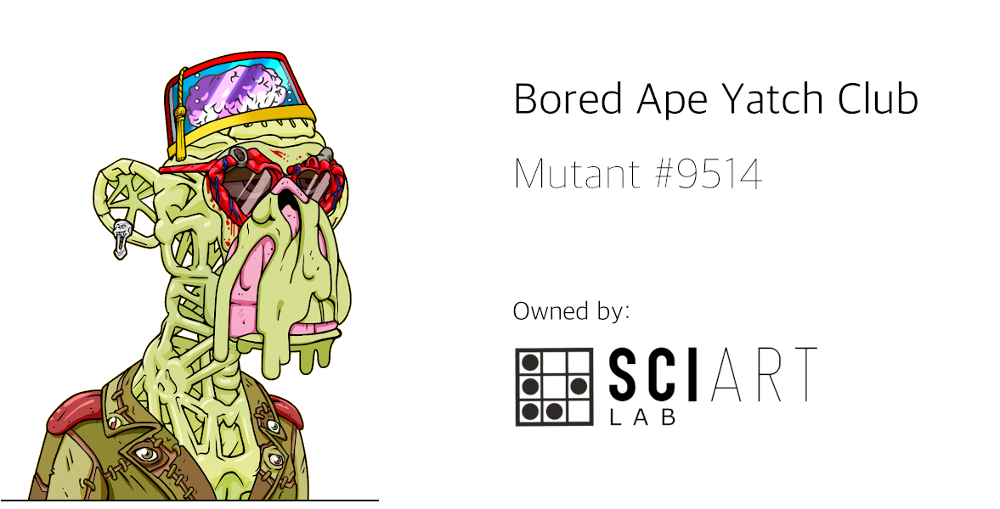

**Mutant #9514** was acquired by the **SciArt Lab** in 2021, with implicit ownership over the artwork, intelectual property rights and membership to [Bored Ape Yatch Club](https://boredapeyachtclub.com/). Since then, **Mutant #9514** has became an altruist mutant ape wanting to use his brand to support artists, experimental projects and social causes. 

**Mutant #9514** is an example of how one NFT can raise awareness about social issues and improve people's lives. To learn more about everything our mutant has accomplished, keep reading.

 

### History

 

* **Mutant #9514** was licensed to **The Writer's Room** on **Jan 1, 2022**. New York Times bestseller writer **Neil Strauss**, in collaboration with the community of license holders, is working on the first blockchain-based collaborative writing book of history. **[[More info](https://www.jenkinsthevalet.com/press)]**

* Mutants and superheroes share some characteristics. Both can do amazing things. And that is the reason for **Mutant #9514** to support the campaign [*Mario wants to run*](https://www.instagram.com/marietequierecorrer/?hl=en) in a very active way. This is a campaign to raise funds and awarensess about **Infantile Cerebral Palsy** and help little superheroes like Mario, whose dream is to be able to run one day. Run with us! **#mariowantstorun**

* In January 2022, **SciArt Lab** authorized [Perris Mackey](https://www.instagram.com/p_ThaNerd/), American collage artist, to use **Mutant #9514** in a piece of analog art. 25% of the benefits will be donated to [R.A.K.E (Random Acts of Kindness Everywhere)](http://www.rakenow.org/), a 501c3 non-profit organization based in Cleveland, Ohio. Additionally, Perris Mackey's artwork will include an easter egg with the hashtag **#mariowantstorun** to support the campaign.

* In February 2022, **SciArt Lab** will include [Marco Fine](https://www.instagram.com/p_ThaNerd/), Italian mural artist, in our **New Talents** program. Marco Fine has been authorized to use **Mutant #9514** in his street art. He is currently painting a mural in Italy based on this mutant to support the campaign [*Mario wants to run*](https://www.instagram.com/marietequierecorrer/?hl=en).

 
 

### Join us

  

To join one of our current campaigns, you can reach us through our [Twitter](https://www.twitter.com/sciartlab) or send an email to **contact@sciartlab.com**.

We are open to talk to artists about how they can use **Mutant #9514** in their art derivatives. We are also willing to support social projects and authorize them to include our mutant in their campaigns.

Join the fam!