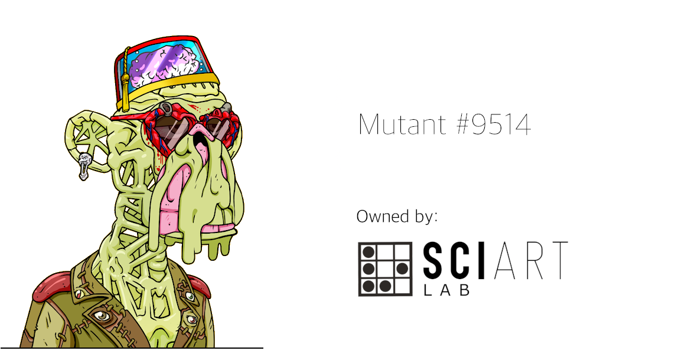

**Mutant #9514** was acquired by the **SciArt Lab** in 2021. This event implies ownership over the artwork, Intelectual Property Rights and Membership to [Bored Ape Yatch Club](https://boredapeyachtclub.com/).

 

### History

 

* **Jan 1, 2022**: **Mutant #9514** has been licensed to **The Writer's Room**. New York Times bestseller writer **Neil Strauss** (in collaboration with the community of license holders) is writing a book now and we are part of it. **[[More info](https://www.jenkinsthevalet.com/press)]**

* **Jan 24, 2022**: **SciArt Lab** has authorized [Perris Mackey](https://www.instagram.com/p_ThaNerd/), American collage artist, to use **Mutant #9514** in a piece of analog art. 25% of the benefits will be donated to [R.A.K.E (Random Acts of Kindness Everywhere)](http://www.rakenow.org/), a 501c3 non-profit organization based in Cleveland, Ohio.   

* **Jan 25, 2022**: **SciArt Lab** has included [Marco Fine](https://www.instagram.com/p_ThaNerd/), Italian mural artist, in our **New Talents** program. Marco Fine has been authorized to paint a mural in Italy using **Mutant #9514**.   