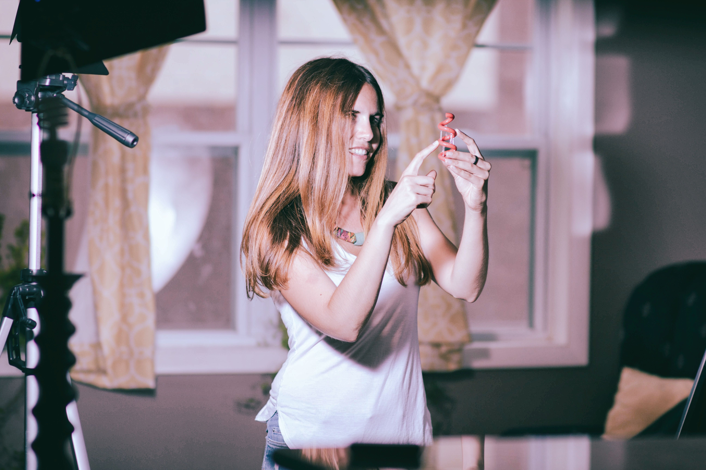
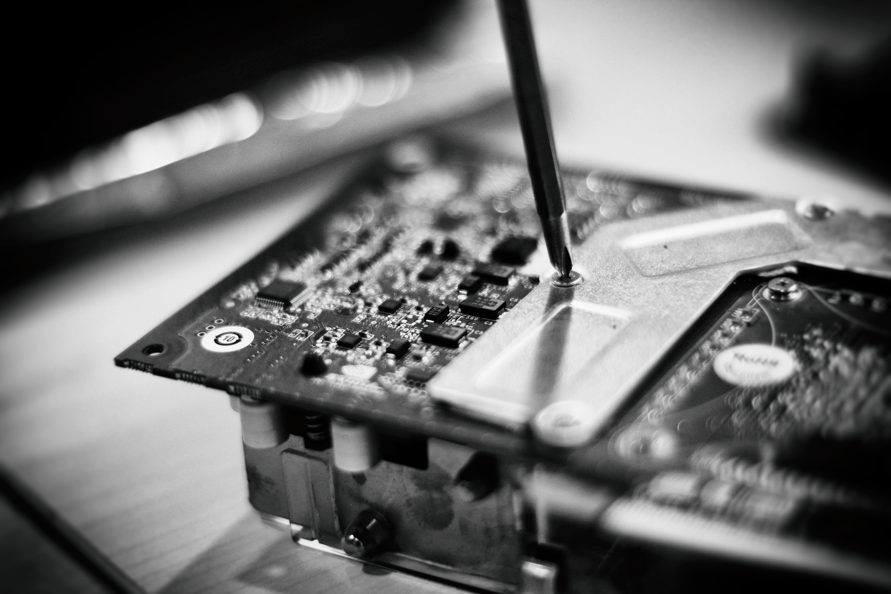
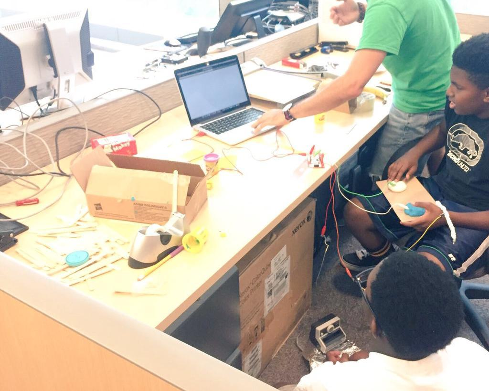
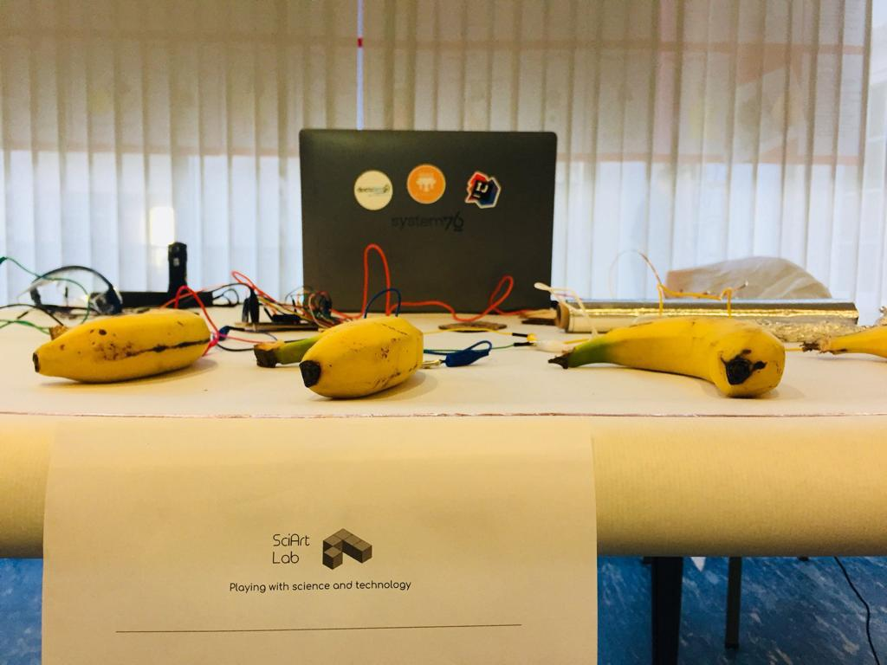

# Challenges for a peer-to-peer educational model 

## Scope

Since the foundation of the **SciArt Lab**, our goal has been the promotion of *do-it-yourself* (DIY) projects and *hands-on* experiences, exploring Science, Art and Technology as emancipatory tools. 

Helping *young hackers* to understand the world with DIY experiments, we wanted to facilitate experiences in which kids could question established epistemologies with critical making, going beyond dogmas and closed assumptions through empirical validation and open experimentation. 

Years before our research career and before the foundation of the **SciArt Lab**, we worked as educators as part of an *International Cooperation* program in Bolivia. We had the chance to collaborate directly with native communities in the Andes, and specially in an educational project with child labourers.

Some years afterwards, during the collaboration with *Reading Connections*, an American nonprofit organization, we could also learn about social dynamics and population clusters such as the ones of immigrants and refugees in the United States. By assisting Program Coordinators, we had the opportunity to research and develop new ways to conduct students from different backgrounds.

This and other experiences with communities worldwide helped us understand the need of models which could be compatible with other ways of living and adaptable to different cultural contexts.

Eventually, our interest in education became something intimately personal. Parenthood led to a conflict with all those social constructs, traditions and systemic dynamics which were radically opposite to what cognitive neuroscience said about learning. 

This was definitely a trigger to look beyond our STEAM-centered approach and start thinking about something bigger.

An alternative way of doing things, informed by scientific evidence but also compatible with our values, could be possible. And the knowledge accumulated during previous research in *peer-to-peer* (P2P) social dynamics and *commons-based peer production* could be a good starting point.

Although the idea begun as a quest for possible answers to our personal problem as parents, this led us to look for a solution extendable to other people: the **P2P School** model.

## Objective  

The **P2P School** model is still in an open exploration phase, still far away from an actual implementation. 

The idea is to bring the principles of the **commons-based peer-production** approach to an educational context, embracing respectful practices and concepts like self-guided education, embodied cognition and sustainability. 

It is therefore a post-digital model, with physical and embodied learning, although facilitated by a technological layer of informational and communication infrastructures.

It is an attempt to share with others our own practices and preferences, while enabling others to do the same with theirs, assuming the heterogeneity of approaches and the importance of sharing both accumulated experience and empirical evidence as commons.

Borrowing some literary jargon, it is intended to define a *solarpunk* alternative to top-down education, a model for a heterogenous ecosystem of learning processes out of dominant school systems, supported by global technology and distributed coordination mechanisms.

As an attempt to embrace freedom as an intrinsic part of learning, we borrow influences from historical pedagogies like the *Modern School* and the *Free School* movements, but also the compromise with social transformation and the search for social justice of *Critical Pedagogy*.  

Questioning dominant social constructs and roles of power, and recognizing a decentralized topology and the co-creation of commons as the foundation of fair human interactions, we assume the **P2P paradigm** as the breeding ground of the next educational revolution. 

Enabling a heterogenous ecosystem of **P2P Schools**, self-organized by the community of learners, could be compatible with different flavours and methodologies through different kinds of nodes:

  * **Family-managed P2P School:** a family or group of families in which both parent/s and kid/s are part of the maintenance of their own educational organization, sharing time, practices, materials, locations, knowledge, resources, and activities.
  
  * **Collective-managed P2P School:** an institution or collective (museum,  hacker space, charity, neighborhood association, university, activist collective, research institution, library...) can manage its own P2P School, providing experiences or resources to other participants in their communities, and co-creating a pool of value in the network.

  * **Professional-managed P2P School:** a group of professional teachers, researchers or educators who are willing to participate. This category can include pilot projects within already existing schools, or initiatives under a profitable school model wanting to create common value for the network.

  [...]

This list is just one possibility and we have not clearly define which would be the proper nodes to consider.

In any case, the project should explore possible solutions to address the main problems of current educational systems, and specially trying to look for alternatives to improve the financial aspect of unschooling.

### The financial problem 

The so-called alternative models of education, usually not funded by governmental entities, are generally excluded from public educational systems and budgets.

The attractive of those children-centric and *respectful* pedagogies, in comparison to the curricula-oriented transmission model of public schools, have led to the arrival of an elitist free market of *alternative schools*.

Branded as *Pikler*, *Montessori*, *Waldorf*, etc... some of those schools constitute a problem of inequality. Their location in areas of high social and economic status and their high fees, only easily affordable for economic elites or the upper-middle class, constitute a bottleneck and a class filter.

Some middle-class families assume a financial effort in terms of capital-labor in order to offer to their kids the possibility of a more respectful and fulfilling education. Some other families, specially those with more than one kid, do not consider that possibility. 

In some cases it is usually cheaper if one of the adults stops working in order to supervise, guide or accompany the kids. In the case of a single-parent household, this does not seem even plausible.

In that regard, opting-out of the public system for an unschooling lifestyle necessarily implies a financial problem in most of the cases, unless the household has rolling assets or passive income.

Actually, the fact of one parent leaving the job market is not always compatible with current life expenses. In cities with high rent, or in households which are paying off a mortgage, renouncing to half of the family income implies a high financial risk. 

In that regard, incorporating an economic model for P2P Schools, in order to guarantee the stability of family income without compromising the co-creation of commons, should be one of the main issues to discuss.

Depending on the age of the unschooled kids, their autonomy and  need for guidance/supervision can vary, and therefore, the *productive time* available for the parent can also increase. 

This financial side is probably one of the most complex aspects, and we hope the discussion could bring multiple ideas to consider. 

### Lack of interoperability

There are hundreds of initiatives to connect **unschooling families** all over the web, local and regional groups, playgroups, conferences and communities.

Interesting initiatives like the *Peer Unschooling Network* [[1]](https://peerunschooling.net), designed for teens, have allowed the emergence of unschooler communities. Nonprofit organizations like the **Alliance for Self-Directed Education (ASDE)** have been years "dedicated to normalizing and legitimizing Self-Directed Education, to make it available to everyone who seeks it" [[2]](https://www.self-directed.org/).

However, there is not a clear framework to bring interoperability to all those initiatives and articulate a commons-based peer-production approach.

One aspect to investigate is if we can bring value to these communities with a framework to operate locally while participating in a global ecosystem; a platform to make visible all those families and communities which are exploring new ways of learning, serving as a channel for interoperability between different methods, practices and approaches, as a mutual benefit for families. 

## Target

Our initial target are families and communities that have access to traditional schools but are considering something beyond a curricula-oriented schooling and homeschooling model:

* Families who are directly embracing **unschooling** as a way to allow their kids to learn in freedom and explore learning in a self-directed way, guided by their interests and not a pre-design curricula.

* Families who are traveling to different countries during years or months as expats, digital nomads, researchers or activists, and find in **worldschooling** an alternative approach for their kids education.

* Families who are forced to *school* their kids but want to offer them an opportunity to learn after-class in a different way through participatory workshops, DIY commons production, etc... but don't have access to maker spaces / hacker spaces / fablabs. 

Additionally, the model may include communities which, due to geographical circumstances or social problems, don't have access to a school system (ie. refugee camps) but that can be connected to the network through a **Collective-managed P2P School**.

In all cases the **P2P Schools** framework should provide value to families' needs, both in the case of:

* **Unschoolers**: during the time span in which this practice is not illegal (ages vary depending on the country) or in which they don't have access to other models of education.

* **Schoolers**: as a complementary tool for self-directed after-class experiences when unschooling is not a possibility.

## Brainstorming

* *Work in progress:* ideas open for discussion.

### Framework

* Logos / Badges / Media / Community identity 
  * Families which don't fit in the current system will find a shared identity by becoming part of P2P Schools. 
* Web Platform:
  * The project should provide the web infrastructure to register a P2P School in the network.
  * P2P Schools will have access to an onboarding process to be included in the network. The onboarding process will include introductory videos and materials to the concept, the values of the project and the common goal of contributing to a new model of education.
  * This platform should allow members to find other P2P Schools in their area and any world location. 
  * P2P Schools will have access to resources, coordination and communication mechanisms with other schools.
* Research outcomes:  
  * P2P Schools will be able to include reports and participate in the polls and research projects.
  * Our research outcomes will provide value to the community, and could serve as a feedback to improve.

**Attention!** **This is just a draft!**    
 The final text will be eventually published with a DOI in [Figshare](https://figshare.com/) or as a preprint in [SocArXiv](https://osf.io/preprints/socarxiv/). As a work in progress, it can be used as a starting point for a discussion, and as material for future papers or projects. Email us to **contact (at) sciartlab.com** if you want to be part of the conversation. This is a work in progress and we are pretty much open to suggestions.
 
## More info

Email us to **contact (at) sciartlab.com**